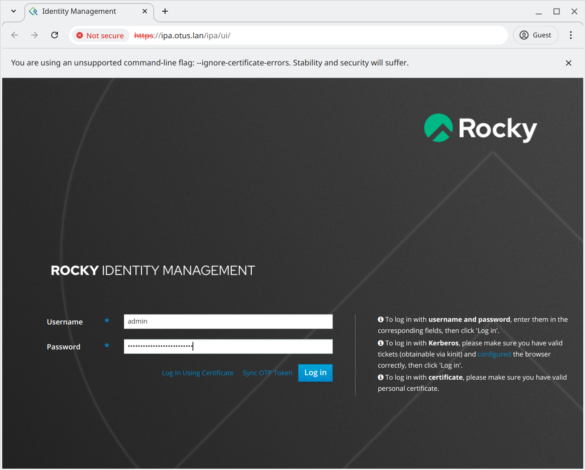
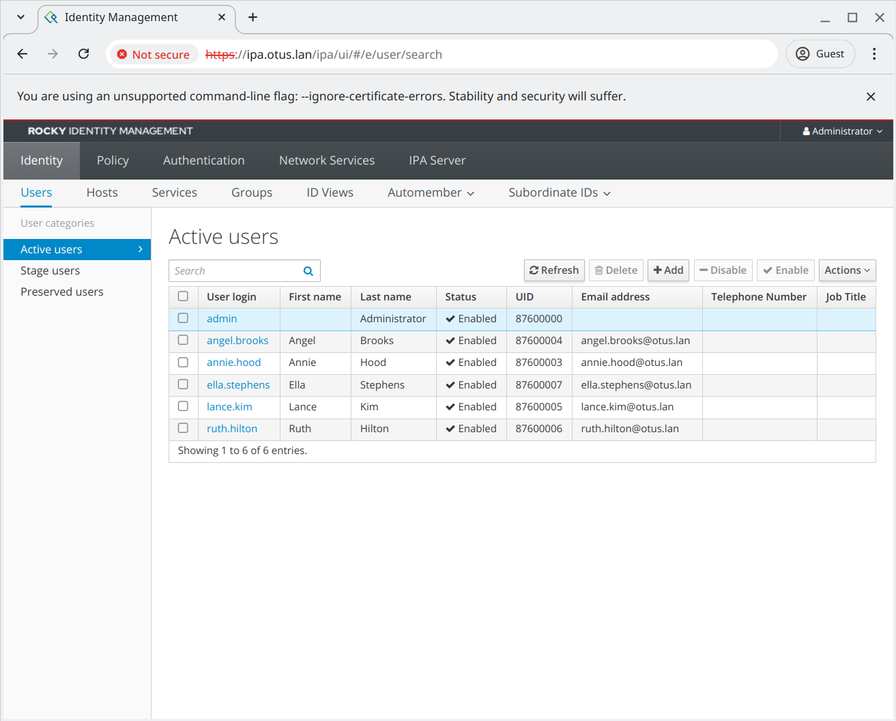
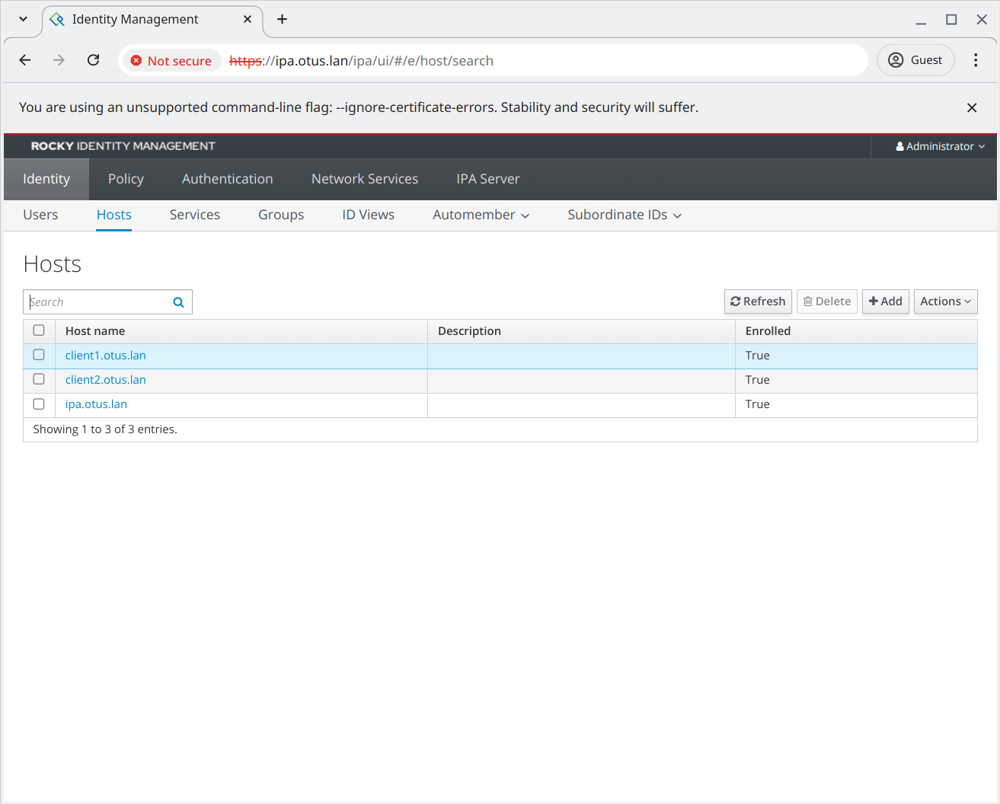

# LDAP

## Задание

1. Установить **FreeIPA**.
2. Написать **playbook** для конфигурации клиента.
3. Настроить аутентификацию по **SSH**-ключам.
4. **Firewall** должен быть включен на сервере и клиенте.

## Реализация

Задание сделано на **rockylinux/9** версии **v9.5-20241118.0**. Для автоматизации процесса написан **Ansible Playbook** [playbook.yml](playbook.yml) который последовательно запускает следующие роли:

- **hosts** - добавляет узлы **ipa**, **client1** и **client2** в `/etc/hosts`;
- **timezone** - устанавливает часовой пояс;
- **chrony** - устанавливает и запускает **chrony**;
- **firewalld** - устанавливает, включает и запускает **firewalld**;
- **ipa_server** - устанавливает **ipa-server** и выполняет команду **ipa-server-install**, разрешает сервис **freeipa-4** в **firewalld**, пароли генерятся автоматически и сохраняются в файлах `passwords/ds_password.txt` и `passwords/admin_password.txt`;
- **ipa_users** - генерирует **ssh**-ключи в директории `passwords` и добавляет пользователей из словаря **ipa_users_dict** в файле [ipa.yml](host_vars/ipa.yml);
- **ipa_client** - устанавливает **ipa-client** и выполняет **ipa-client-install** на клиентах.

Настройки для ролей имеют префикс с именем роли и доступны в файлах:

- [group_vars/all.yml](group_vars/all.yml)
- [host_vars/ipa.yml](host_vars/ipa.yml)
- [host_vars/client1.yml](host_vars/client1.yml)
- [host_vars/client2.yml](host_vars/client2.yml)

## Запуск

Необходимо скачать **VagrantBox** для **rockylinux/9** версии **v9.5-20241118.0** и добавить его в **Vagrant** под именем **rockylinux/9/v9.5-20241118.0**. Сделать это можно командами:

```shell
curl -OL https://dl.rockylinux.org/pub/rocky/9.5/images/x86_64/Rocky-9-Vagrant-Vbox-9.5-20241118.0.x86_64.box
vagrant box add Rocky-9-Vagrant-Vbox-9.5-20241118.0.x86_64.box --name "rockylinux/9/v9.5-20241118.0"
rm Rocky-9-Vagrant-Vbox-9.5-20241118.0.x86_64.box
```

Для того, чтобы **vagrant 2.3.7** работал с **VirtualBox 7.1.0** необходимо добавить эту версию в **driver_map** в файле **/usr/share/vagrant/gems/gems/vagrant-2.3.7/plugins/providers/virtualbox/driver/meta.rb**:

```ruby
          driver_map   = {
            "4.0" => Version_4_0,
            "4.1" => Version_4_1,
            "4.2" => Version_4_2,
            "4.3" => Version_4_3,
            "5.0" => Version_5_0,
            "5.1" => Version_5_1,
            "5.2" => Version_5_2,
            "6.0" => Version_6_0,
            "6.1" => Version_6_1,
            "7.0" => Version_7_0,
            "7.1" => Version_7_0,
          }
```

После этого нужно сделать **vagrant up**.

Протестировано в **OpenSUSE Tumbleweed**:

- **Vagrant 2.3.7**
- **VirtualBox 7.1.4_SUSE r165100**
- **Ansible 2.17.6**
- **Python 3.11.10**
- **Jinja2 3.1.4**

## Проверка

Проверим работу **WEB**-интерфейса **FreeIPA**. Для этого с помощью **SSH** поднимем **SOCKS**-прокси на **client1** и подключимся к **WEB**-интерфейсу с помощью **Chrome** через этот **SOCKS**-прокси. В качестве имени пользователя будем использовать **admin**, а пароль возьмём в файле `passwords/admin_password.txt`:

```text
❯ ssh -N -D 1080 -i passwords/annie.hood annie.hood@192.168.56.11 &
[1] 149850

❯ /opt/google/chrome/google-chrome --no-first-run --user-data-dir=/tmp/chrome --guest --proxy-server=socks5://127.0.0.1:1080 --ignore-certificate-errors https://ipa.otus.lan
```

Откроется диалог, поскольку мы используем **SOCKS**-прокси (команда `ssh -N -D 1080`), то нам не понадобилось добавлять запись в `192.168.56.10 ipa.otus.lan` в `/etc/hosts` (она уже добавлена на виртуальной машине **client1** через которую мы подключаемся):



После входа можно посмотреть список пользователей:



Также можно посмотреть узлы в домене:



Удалим временный профиль **Chrome** и завершим **SOCKS**-прокси:

```text
❯ rm /tmp/chrome -r

❯ kill %1
[1]+  Done                    ssh -N -D 1080 -i passwords/annie.hood annie.hood@192.168.56.11
```

Подключимся к серверу **ipa** и войдём под учётной записью администратора (пароль есть в `passwords/admin_password.txt`):

```text
❯ vagrant ssh ipa
Last login: Tue Nov 26 14:54:24 2024 from 10.0.2.2
[vagrant@ipa ~]$ kinit admin
Password for admin@OTUS.LAN:
[vagrant@ipa ~]$ klist
Ticket cache: KCM:1000
Default principal: admin@OTUS.LAN

Valid starting       Expires              Service principal
11/26/2024 14:55:22  11/27/2024 14:29:42  krbtgt/OTUS.LAN@OTUS.LAN
```

Проверим список рабочих станций в домене:

```text
[vagrant@ipa ~]$ ipa host-find
---------------
3 hosts matched
---------------
  Host name: client1.otus.lan
  Platform: x86_64
  Operating system: 5.14.0-503.14.1.el9_5.x86_64
  Principal name: host/client1.otus.lan@OTUS.LAN
  Principal alias: host/client1.otus.lan@OTUS.LAN
  SSH public key fingerprint: SHA256:T8Jme/GFGDO8aHU9V05QIJwu2/ru14Odu0bpFOxF6Q4 (ecdsa-sha2-nistp256),
                              SHA256:AEb35Z4lu6HCyp4ADJQ+4RnczqF1a2EQlRYJJQ4qBXU (ssh-ed25519),
                              SHA256:0lDVaOsRtjOHFkbP37JCyyGNgntp7TiqOv68cxKv6BI (ssh-rsa)

  Host name: client2.otus.lan
  Platform: x86_64
  Operating system: 5.14.0-503.14.1.el9_5.x86_64
  Principal name: host/client2.otus.lan@OTUS.LAN
  Principal alias: host/client2.otus.lan@OTUS.LAN
  SSH public key fingerprint: SHA256:PpPnfq9UM+7BYpYJv48/BZwFUvt1QEXIaluS54zfSgM (ecdsa-sha2-nistp256),
                              SHA256:cMOP9ulFQgpNQmtk0zytB7WpwST3RNz4HhAVg5oyFtk (ssh-ed25519),
                              SHA256:XiZ4Evx9kPKcdsPHGb8/tKPle1NBrcgXGbUW2pXsl4w (ssh-rsa)

  Host name: ipa.otus.lan
  Principal name: host/ipa.otus.lan@OTUS.LAN
  Principal alias: host/ipa.otus.lan@OTUS.LAN
  SSH public key fingerprint: SHA256:CE8ohyP4THbFbwnxwRvSZ8GT6AOnA41rD3ZHjqxbCZM (ecdsa-sha2-nistp256),
                              SHA256:kA8sl3VlW/gDswysHJFgytxTjjixgMoxPz1l/+f/jKQ (ssh-ed25519),
                              SHA256:gN4qsZs/3hYNbsMPLQzietk+jpQwvOQtEAMMVG6P92w (ssh-rsa)
```

Проверим список пользователей:

```text
[vagrant@ipa ~]$ ipa user-find
---------------
6 users matched
---------------
  User login: admin
  Last name: Administrator
  Home directory: /home/admin
  Login shell: /bin/bash
  Principal alias: admin@OTUS.LAN, root@OTUS.LAN
  UID: 87600000
  GID: 87600000
  Account disabled: False

  User login: angel.brooks
  First name: Angel
  Last name: Brooks
  Home directory: /home/angel.brooks
  Login shell: /bin/bash
  Principal name: angel.brooks@OTUS.LAN
  Principal alias: angel.brooks@OTUS.LAN
  Email address: angel.brooks@otus.lan
  UID: 87600004
  GID: 87600004
  SSH public key fingerprint: SHA256:wWdcgzw/gHJyLBb54BwEMxLUfw+kAdbEYQl7ID4FXAE (ssh-ed25519)
  Account disabled: False

  User login: annie.hood
  First name: Annie
  Last name: Hood
  Home directory: /home/annie.hood
  Login shell: /bin/bash
  Principal name: annie.hood@OTUS.LAN
  Principal alias: annie.hood@OTUS.LAN
  Email address: annie.hood@otus.lan
  UID: 87600003
  GID: 87600003
  SSH public key fingerprint: SHA256:mG/m9mLdVnENlnXW8d50/U17/QL7c0uT8iWOv8XFOMw (ssh-ed25519)
  Account disabled: False

  User login: ella.stephens
  First name: Ella
  Last name: Stephens
  Home directory: /home/ella.stephens
  Login shell: /bin/bash
  Principal name: ella.stephens@OTUS.LAN
  Principal alias: ella.stephens@OTUS.LAN
  Email address: ella.stephens@otus.lan
  UID: 87600007
  GID: 87600007
  SSH public key fingerprint: SHA256:pIG8Gql0qa252Z/tKWBh6DgpmyeVuKIGnhz7OK1RmJE (ssh-ed25519)
  Account disabled: False

  User login: lance.kim
  First name: Lance
  Last name: Kim
  Home directory: /home/lance.kim
  Login shell: /bin/bash
  Principal name: lance.kim@OTUS.LAN
  Principal alias: lance.kim@OTUS.LAN
  Email address: lance.kim@otus.lan
  UID: 87600005
  GID: 87600005
  SSH public key fingerprint: SHA256:GfmQMvrLOVqCPShVQITHctcA5kdcfIUuturq0ZyxNtU (ssh-ed25519)
  Account disabled: False

  User login: ruth.hilton
  First name: Ruth
  Last name: Hilton
  Home directory: /home/ruth.hilton
  Login shell: /bin/bash
  Principal name: ruth.hilton@OTUS.LAN
  Principal alias: ruth.hilton@OTUS.LAN
  Email address: ruth.hilton@otus.lan
  UID: 87600006
  GID: 87600006
  SSH public key fingerprint: SHA256:Do6HVw83rpkmbebR6K1JKskxaPy6Izm9u/fXuQu8nzw (ssh-ed25519)
  Account disabled: False
----------------------------
Number of entries returned 6
----------------------------
```

Проверим включён ли **firewalld** и **SELinux**:

```text
[vagrant@ipa ~]$ getenforce
Enforcing
[vagrant@ipa ~]$ systemctl status firewalld
● firewalld.service - firewalld - dynamic firewall daemon
     Loaded: loaded (/usr/lib/systemd/system/firewalld.service; enabled; preset: enabled)
     Active: active (running) since Tue 2024-11-26 14:32:34 MSK; 30min ago
       Docs: man:firewalld(1)
   Main PID: 667 (firewalld)
      Tasks: 2 (limit: 12258)
     Memory: 29.0M
        CPU: 364ms
     CGroup: /system.slice/firewalld.service
             └─667 /usr/bin/python3 -s /usr/sbin/firewalld --nofork --nopid
```

Попробуем подключиться на клиенты с использованием **SSH** ключей пользователей:

```text
❯ ssh -i passwords/annie.hood annie.hood@192.168.56.11
The authenticity of host '192.168.56.11 (192.168.56.11)' can't be established.
ED25519 key fingerprint is SHA256:AEb35Z4lu6HCyp4ADJQ+4RnczqF1a2EQlRYJJQ4qBXU.
This key is not known by any other names.
Are you sure you want to continue connecting (yes/no/[fingerprint])? yes
Warning: Permanently added '192.168.56.11' (ED25519) to the list of known hosts.
[annie.hood@client1 ~]$ exit
logout
Connection to 192.168.56.11 closed.

❯ ssh -i passwords/ella.stephens ella.stephens@192.168.56.11
[ella.stephens@client1 ~]$ exit
logout
Connection to 192.168.56.11 closed.

❯ ssh -i passwords/lance.kim lance.kim@192.168.56.12
The authenticity of host '192.168.56.12 (192.168.56.12)' can't be established.
ED25519 key fingerprint is SHA256:cMOP9ulFQgpNQmtk0zytB7WpwST3RNz4HhAVg5oyFtk.
This key is not known by any other names.
Are you sure you want to continue connecting (yes/no/[fingerprint])? yes
Warning: Permanently added '192.168.56.12' (ED25519) to the list of known hosts.
[lance.kim@client2 ~]$ exit
logout
Connection to 192.168.56.12 closed.

❯ ssh -i passwords/ruth.hilton ruth.hilton@192.168.56.12
[ruth.hilton@client2 ~]$ exit
logout
Connection to 192.168.56.12 closed.
```

Проверим работу **firewalld** на клиентах:

```text
❯ ssh -i passwords/annie.hood annie.hood@192.168.56.11
Last login: Tue Nov 26 15:05:55 2024 from 192.168.56.1
[annie.hood@client1 ~]$ systemctl status firewalld.service
● firewalld.service - firewalld - dynamic firewall daemon
     Loaded: loaded (/usr/lib/systemd/system/firewalld.service; enabled; preset: enabled)
     Active: active (running) since Tue 2024-11-26 14:33:04 MSK; 35min ago
       Docs: man:firewalld(1)
   Main PID: 656 (firewalld)
      Tasks: 2 (limit: 5817)
     Memory: 40.1M
        CPU: 266ms
     CGroup: /system.slice/firewalld.service
             └─656 /usr/bin/python3 -s /usr/sbin/firewalld --nofork --nopid
[annie.hood@client1 ~]$ exit
logout
Connection to 192.168.56.11 closed.

❯ ssh -i passwords/ruth.hilton ruth.hilton@192.168.56.12
Last login: Tue Nov 26 15:07:22 2024 from 192.168.56.1
[ruth.hilton@client2 ~]$ systemctl status firewalld.service
● firewalld.service - firewalld - dynamic firewall daemon
     Loaded: loaded (/usr/lib/systemd/system/firewalld.service; enabled; preset: enabled)
     Active: active (running) since Tue 2024-11-26 14:33:34 MSK; 35min ago
       Docs: man:firewalld(1)
   Main PID: 656 (firewalld)
      Tasks: 2 (limit: 5817)
     Memory: 38.3M
        CPU: 261ms
     CGroup: /system.slice/firewalld.service
             └─656 /usr/bin/python3 -s /usr/sbin/firewalld --nofork --nopid
[ruth.hilton@client2 ~]$ exit
logout
Connection to 192.168.56.12 closed.
```

Как видно все задания выполнены.
